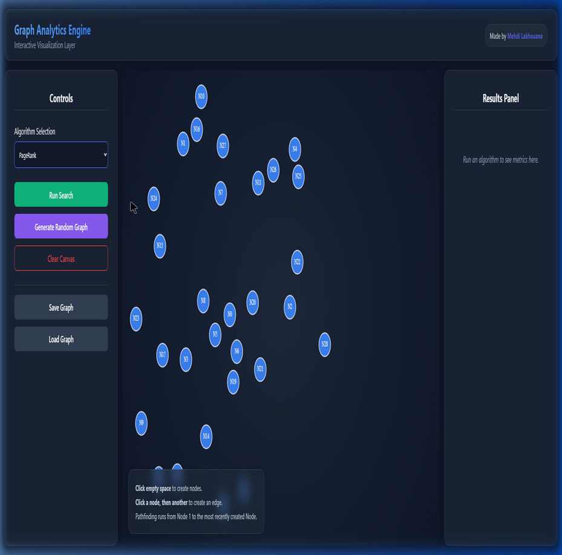

# Graph Analytics Engine

A high-performance, full-stack **Graph Analytics Engine** built entirely from scratch to ingest, process, and dynamically visualize complex graphs. This system demonstrates advanced knowledge of data structures, algorithm design, and modern web application development.

**Created by: Mehdi Lakhouane**

---

## Features

### Core Graph Algorithms (9 Total)
Implemented using the Strategy Design Pattern for robust and extensible architecture:

| Category | Algorithm | Description |
|---|---|---|
| **Shortest Path** | Dijkstra | Optimal path via priority queue with early termination |
| **Shortest Path** | A\* Search | Heuristic-enhanced pathfinding using Euclidean distance |
| **Traversal** | BFS | Breadth-first graph exploration |
| **Traversal** | DFS | Depth-first recursive traversal |
| **Ranking** | PageRank | Iterative importance scoring with damping factor and convergence tolerance |
| **Community** | Louvain | Modularity optimization for community detection |
| **Centrality** | Closeness | Node accessibility scoring based on shortest-path distances |
| **Centrality** | Betweenness | Brandes' algorithm for bridge-node identification (weighted + unweighted) |

### Advanced Data Structures
- Custom `Node`, `Edge`, and `Graph` domain models with full mutation support (add/remove nodes and edges).
- **Adjacency List** graph representation with both outgoing and incoming edge indexes for efficient algorithm execution.
- Thread-safe implementation using `ConcurrentHashMap` and `ReentrantReadWriteLock` for safe concurrent access.

### Interactive Visualization Layer



- **Vue 3 + Vite** frontend with a dark-mode glassmorphism aesthetic.
- **3-Column Dashboard:** Controls Sidebar, Interactive HTML5 Canvas, and Results Panel.
- **Drag-to-move nodes** with click/drag distinction for intuitive graph editing.
- **Zoom and pan:** Scroll to zoom toward cursor, Ctrl+drag to pan the viewport.
- **Force-directed scattering:** Automatically positions nodes with collision avoidance.
- **Live algorithm visualization:** Paths, traversals, and metrics render instantly on the canvas.
- **Loading states and modals:** Spinner overlay during API calls, custom modal dialogs for save/load.
- **Error handling:** Inline error display in results panel instead of browser alerts.

### REST API
- 16 endpoints for graph CRUD, algorithm execution, and persistence.
- Full **Swagger/OpenAPI documentation** at `/swagger-ui.html`.
- Input validation on all parameters with descriptive error messages.
- Configurable CORS origins via application properties.

### Security
- Path traversal protection on file save/load with filename whitelist and sandboxed storage directory.
- URL-safe parameter encoding on the frontend.
- Scoped CORS configuration (API paths only).

---

## Tech Stack

| Layer | Technology |
|---|---|
| **Backend** | Java 21, Spring Boot 3.2, Maven |
| **Frontend** | Vue 3, Vite, Axios |
| **API Docs** | SpringDoc OpenAPI (Swagger UI) |
| **Testing** | JUnit 5, Spring MockMvc, Vitest, Vue Test Utils |
| **DevOps** | Docker (multi-stage), Docker Compose, Spring Actuator |

---

## Getting Started

### Option 1: Docker (Recommended)

```bash
docker compose up --build
```

The application will be available at `http://localhost:8080`.

### Option 2: Manual Setup

#### Prerequisites
- **Java 21** or later
- **Node.js 18+** and **npm**

#### Run the Backend
```bash
./mvnw spring-boot:run
```
The REST API launches on `http://localhost:8080`.

#### Run the Frontend
```bash
cd frontend
npm install
npm run dev
```
The interactive canvas launches on `http://localhost:5173`.

---

## API Documentation

With the backend running, visit:
- **Swagger UI:** `http://localhost:8080/swagger-ui.html`
- **OpenAPI JSON:** `http://localhost:8080/v3/api-docs`

Endpoints are organized into three groups:
- **Graph Management** -- Create, seed, query, and mutate graphs
- **Algorithms** -- Execute any of the 9 graph algorithms
- **Persistence** -- Save/load graphs as JSON files

---

## Testing

### Backend (JUnit 5)
```bash
./mvnw test
```
Covers all 9 algorithms, graph mutations, and controller integration.

### Frontend (Vitest)
```bash
cd frontend
npm test
```
15 tests covering component rendering, modal flow, loading states, error handling, and result sorting.

---

## Project Structure

```
Graph-Analytics-Engine/
  src/main/java/com/graphanalytics/
    algorithm/        # 9 algorithm implementations + Strategy interface
    config/           # WebConfig (CORS), OpenApiConfig (Swagger)
    controller/       # GraphController + GlobalExceptionHandler
    domain/           # Node, Edge, Graph, AdjacencyListGraph
    service/          # GraphService, GraphStorageService, GraphValidator
  src/test/           # JUnit + MockMvc tests
  frontend/
    src/
      components/     # GraphCanvas.vue (canvas + interactions)
      __tests__/      # Vitest test suite
      App.vue         # Main app layout + controls + results
      style.css       # Global dark theme + glassmorphism
  Dockerfile          # Multi-stage build (JDK + Node + JRE)
  docker-compose.yml  # One-command deployment
  pom.xml             # Maven dependencies
```

---

**Author:** Mehdi Lakhouane
**License:** MIT
